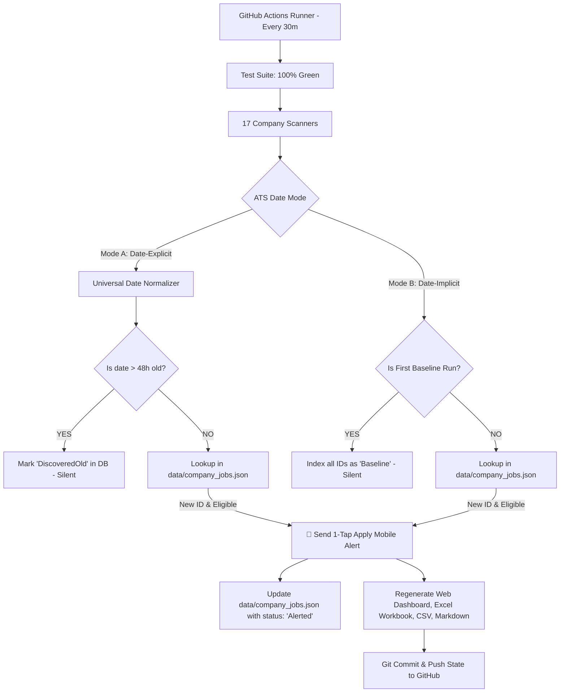

# Career Job Monitor 🚀

Automated 24/7 job monitoring engine running every 30 minutes on GitHub Actions. It scans 17 top technology career portals, maintains a persistent per-company job catalog, extracts native ATS publication dates, and delivers instant **1-Tap Apply** mobile notifications to your phone lock screen for newly released early-career roles.

---

## 🎯 Target Profile & Strict Filtering Rules

A job is classified as **Included (Eligible)** only when it strictly satisfies all five criteria:

1. **Discipline:** Software engineering, software development, AI, machine learning, data engineering, platform, SRE, DevOps, cloud, mobile (iOS/Android), systems, firmware, or adjacent technical domains.
2. **Seniority:** 0–3 years experience (Entry-Level, Associate, New Grad, SWE I, SWE II).
   - **Strictly Excluded:** Senior, Staff, Principal, Lead, Director, Architect, Level III/IV+ (`SWE III`, `Engineer III`, `Level 3+`, `IC3+`, `Tier 3+`, `Experienced` prefix).
3. **Location:** **Strictly United States** (US cities, states, or US-Remote). All international roles (e.g. Dublin, London, Bangalore, Toronto, EMEA, APAC) are rejected.
4. **Freshness Barrier:** Released within **$\le 48$ hours** (Today, Yesterday, or 2 days). Older postings (e.g. 4+ days, April 2026) are rejected.
5. **Sponsorship & Eligibility:**
   - **Allowed:** Sponsorship available, future sponsorship possible, sponsorship not mentioned.
   - **Rejected:** Explicit statement denying current/future visa sponsorship or OPT/CPT eligibility.
   - **Internships:** Full-time/part-time graduate-eligible internships qualify; internships requiring current student enrollment are rejected.

---

## 🏗️ System Architecture & Dual-Mode Ingestion Engine



### Dual-Mode Handling:
- **Mode A (Date-Explicit Portals):** *Oracle HCM (JPMorgan, Oracle), Workday (Intel, US Bank, Fidelity), Eightfold (Qualcomm), Phenom (Cisco), Amazon, Apple.*
  - Even if search results return listings in arbitrary/shuffled order, the scraper extracts the exact publication timestamp from API payloads or DOM labels (`Posting Date: MM/DD/YYYY`). Postings $> 48$h old are indexed silently without triggering false alerts.
- **Mode B (Date-Implicit Portals):** *Meta, Google, Microsoft, Goldman Sachs.*
  - On cold start, all existing listings are baselined. On incremental runs, newly appeared unique requisition IDs are recognized as genuine new releases within that 30-minute window.

---

## 🏢 Monitored Companies & ATS Platforms

| ID | Company | Platform / ATS | Career Portal Scope |
|---|---|---|---|
| `CMP-001` | Amazon.com Services LLC | Amazon Jobs REST API | US Software Engineering / Applied Science |
| `CMP-002` | Meta Platforms, Inc | Meta Careers | US Software Engineering |
| `CMP-003` | Google LLC | Google Applications API | US Early Career Campus & SWE |
| `CMP-004` | Apple Inc | Apple Jobs REST API | US Software & Hardware Engineering |
| `CMP-005` | Fidelity Investments | Workday | US Technology & Software |
| `CMP-006` | IBM Corporation | IBM Careers | US Software Engineering & Cloud |
| `CMP-007` | Qualcomm Technologies, Inc | Eightfold.ai | US Software & Embedded Engineering |
| `CMP-008` | JPMorgan Chase & Co | Oracle Cloud HCM | US Software Engineering |
| `CMP-009` | Intel Corporation | Workday | US Software Engineering |
| `CMP-010` | Oracle America, Inc | Oracle Cloud HCM | US Software Development & Cloud |
| `CMP-011` | Microsoft Corporation | Microsoft TalentNet | US Engineering & Technology |
| `CMP-012` | Cisco Systems, Inc | Phenom People | US Software Engineering |
| `CMP-013` | U.S. Bank National Association | Workday | US Technology & Architecture |
| `CMP-014` | Wells Fargo Bank, N.A. | WellsFargoJobs | US Technology & Software |
| `CMP-015` | Compunnel Software Group | Staffline | US Software & Cloud |
| `CMP-016` | Microsoft | Microsoft Careers | US Software Engineering |
| `CMP-017` | Goldman Sachs | Higher.gs.com | US Engineering & Technology |

---

## 📲 Access Channels & Live Dashboards

1. **Live Interactive Website:** [https://taran-dev4u.github.io/career-job-monitor/](https://taran-dev4u.github.io/career-job-monitor/)
   - View active eligible roles, search by company/title, view actual company `Posted Date`, and track applications locally (`✓ Applied` / `✕ Dismiss`).
2. **Instant Mobile Push Notifications (ntfy.sh):**
   - Install the **ntfy** app on iOS / Android.
   - Subscribe to topic: **`taran-career-jobs-2026`** ([https://ntfy.sh/taran-career-jobs-2026](https://ntfy.sh/taran-career-jobs-2026)).
   - Receive instant push notifications with direct **1-Tap Apply Now** action buttons.
3. **Google Sheets Live Auto-Sync:**
   - In any Google Sheet cell `A1`, paste:
     ```text
     =IMPORTDATA("https://raw.githubusercontent.com/taran-dev4u/career-job-monitor/main/data/apply_now.csv")
     ```
   - Automatically refreshes active eligible jobs with clickable apply links.
4. **Excel 7-Sheet Audit Workbook:** [`outputs/job-monitor/Job_Monitor.xlsx`](outputs/job-monitor/Job_Monitor.xlsx)
   - Contains *Apply Now*, *New Jobs*, *All Extracted Jobs*, *Decision Audit*, *Source Health*, *Run Log*, and *Companies*.
5. **GitHub Markdown Dashboards:**
   - [Filtered Eligible Jobs (`LATEST_JOBS.md`)](LATEST_JOBS.md)
   - [Unfiltered Extracted Snapshot (`ALL_EXTRACTED_JOBS.md`)](ALL_EXTRACTED_JOBS.md)

---

## 🤖 Multi-Agent Operating Rules & Precedence

This repository is maintained collaboratively by autonomous coding agents. **Every agent working in this folder must adhere to [`AGENTS.md`](AGENTS.md):**

1. **Instruction Precedence:** User explicit instructions $\to$ `AGENTS.md` $\to$ `README.md` $\to$ Agent assumptions.
2. **Coordination via Agent Change Ledger:**
   - Before editing, agents must read `AGENTS.md`, check for active tasks, and create an `IN_PROGRESS` entry.
   - After verification, agents update their ledger entry to `DONE`. Completed entries are **immutable history** and must never be deleted or modified.
3. **Sources of Truth Integrity:**
   - Never clear `data/company_jobs.json`, `data/state.json`, `data/jobs.json`, or reset historical databases.
   - Never edit `Job_Monitor.xlsx` directly; rebuild it from source code using `node src/build_workbook_ci.mjs --verify`.
   - Run `npm test` before committing any code changes.

